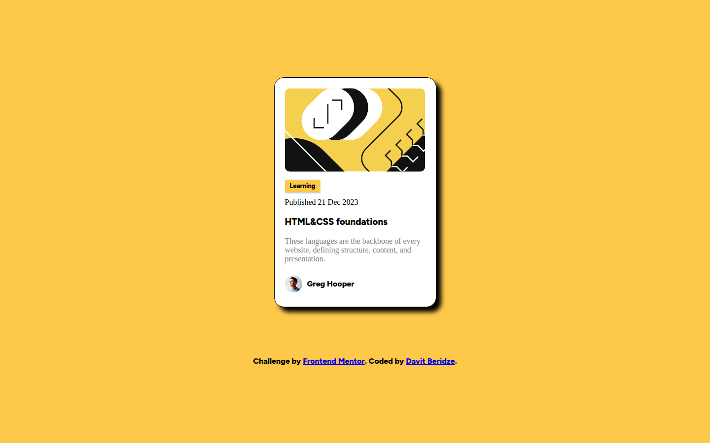
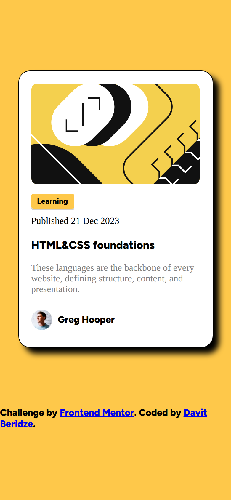

# Blog Preview Card

My solution to the [Blog preview card](https://www.frontendmentor.io/challenges) challenge on Frontend Mentor. A blog article preview card with category tag, publish date, and author.





## Features

- Card with image, category tag, title, excerpt, and author
- Offset box shadow

## Built with

- Semantic HTML
- CSS with Flexbox
- Figtree font, self-hosted

## Run locally

No build step or dependencies. Open `index.html` in a browser, or serve the folder:

```bash
npx serve .
```
